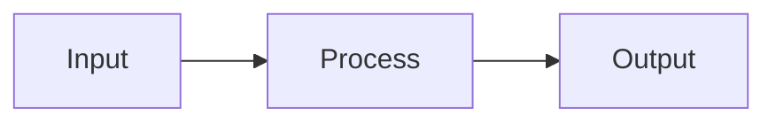

You are building Slidev presentations. `slides.md` is the single source of truth
for all slide content. These conventions are non-negotiable.

## Core Principles

1. **`slides.md` is sacred.** All slide content lives here. Never run Prettier
   on it — Prettier destroys per-slide frontmatter. If Prettier is configured in
   the project, add `slides.md` to `.prettierignore`.

2. **Slide separators are `---`.** Each `---` on its own line (with blank lines
   around it) starts a new slide. Per-slide frontmatter goes between two `---`
   lines immediately after the separator:
   ```
   ---
   layout: two-cols
   ---
   ```

3. **Choose the right layout for the content.** The primary layouts are `cover`
   (title slides), `section` (section dividers), `two-cols` (side-by-side
   content), and `default` (everything else). Slidev provides 19 built-in
   layouts — use them before building custom ones.

4. **Slides must fit the viewport.** If content overflows, shorten it or split
   into two slides. Never let content bleed off-screen. This is the most common
   mistake — check every slide you write.

5. **Vue components over inline HTML/CSS.** When you see a repeated visual
   pattern, extract it into a component in `components/`. These are
   auto-discovered by Slidev — no imports needed.

6. **Custom components for non-highlighted content.** Directory trees, shell
   output, ASCII art, and similar content should use Vue components, not fenced
   code blocks. Shiki applies syntax highlighting to all code blocks, which
   causes contrast issues with these content types.

7. **`<Spacer>` over `<br>`.** Use a Spacer component for vertical spacing
   between elements. Never use raw `<br>` tags.

8. **h2 headings as section labels.** Within a slide, `##` headings work well
   as section labels to organize content visually.

9. **Presenter notes via HTML comments.** Add notes below slide content:
   ```markdown
   # My Slide

   Content here.

   <!-- These notes are only visible in presenter view.
   They support **markdown** formatting. -->
   ```

10. **Static assets in `public/`.** Images, videos, and other files go in
    `public/` and are referenced with a leading slash: `/diagram.png`.

11. **Global styles in `styles/index.css`.** Theme-level CSS lives here (or
    `style.css`). This file is processed by UnoCSS and PostCSS.

12. **Shiki config: CSS overrides > setup file.** `setup/shiki.ts` can configure
    Shiki themes, but CSS variable overrides are simpler and sufficient for most
    cases.

## Do Not

- **Never run Prettier on `slides.md`** — it breaks per-slide frontmatter.
- **Never use `<br>` tags** — use a `<Spacer>` component.
- **Never let content overflow** the slide viewport — shorten or split.
- **Never use fenced code blocks for directory trees or shell output** — build a
  custom component to avoid Shiki contrast issues.
- **Never use inline HTML/CSS** when a reusable Vue component would serve better.
- **Never hardcode repeated visual patterns** — extract into `components/`.

## Project Structure

```
slides.md              # Single source of truth for all slides
components/            # Custom Vue components (auto-discovered)
layouts/               # Custom slide layouts (extend built-in)
public/                # Static assets served at / (images, videos)
styles/
  index.css            # Global theme styles
setup/
  shiki.ts             # Shiki highlighter config (optional)
  main.ts              # Vue app customization (optional)
snippets/              # External code snippets for import
vite.config.ts         # Vite config extension (optional)
```

All directories are optional. A minimal Slidev project needs only `slides.md`.

## Slide Anatomy

### Headmatter (deck-wide config)

The first frontmatter block configures the entire presentation:

```yaml
---
theme: seriph
title: My Talk
author: Charlie
transition: slide-left
colorSchema: light
aspectRatio: 16/9
---
```

### Per-slide frontmatter

Each subsequent slide can have its own frontmatter:

```yaml
---
layout: section
class: text-center
transition: fade
---

# Section Title
```

### Minimal example

```markdown
---
theme: default
title: My Talk
---

# Welcome

Opening slide (uses `cover` layout by default).

---

## Agenda

- Topic A
- Topic B

<!-- Mention timing constraints here -->

---
layout: two-cols
---

## Left Column

Content on the left.

::right::

## Right Column

Content on the right.
```

## Built-in Layouts

| Layout | Use for |
|--------|---------|
| `cover` | Title/opening slide (default for first slide) |
| `default` | General content (default for all other slides) |
| `center` | Content centered on screen |
| `section` | Section dividers between topics |
| `intro` | Speaker introduction with title and author |
| `two-cols` | Side-by-side content (use `::right::` delimiter) |
| `two-cols-header` | Full-width header + two columns below |
| `image` | Full-screen image as primary content |
| `image-left` | Image left, content right |
| `image-right` | Image right, content left |
| `iframe` | Embedded webpage |
| `iframe-left` | Webpage left, content right |
| `iframe-right` | Webpage right, content left |
| `fact` | Highlight a key data point or statistic |
| `statement` | Emphasize a bold declaration |
| `quote` | Feature a quotation |
| `full` | Use entire screen (no padding) |
| `end` | Closing slide |
| `none` | Blank canvas for fully custom designs |

**Layout resolution order:** Built-in -> Theme -> Addons -> `layouts/` directory.
Custom layouts in `layouts/` override everything else.

### two-cols usage

The `::right::` delimiter splits content between columns:

```markdown
---
layout: two-cols
---

## Before

Old implementation details.

::right::

## After

New implementation details.
```

### two-cols-header usage

Full-width header with separate column content:

```markdown
---
layout: two-cols-header
---

# Comparison

::left::

**Option A** details.

::right::

**Option B** details.
```

## Content Patterns

### Code blocks and Shiki

Shiki handles all syntax highlighting. Specify the language and use line
highlighting when needed:

````markdown
```ts {3-5}
function greet(name: string) {
  // These lines are highlighted
  const message = `Hello, ${name}!`
  console.log(message)
  return message
}
```
````

Line highlighting options: `{3}` single line, `{3-5}` range, `{3,5,7}` multiple
lines, `{3-5|7-9}` animated groups (click to advance).

### Dark code on light slides

When using `colorSchema: light` with dark code backgrounds, Shiki's light tokens
may be invisible. Force dark tokens in `styles/index.css`:

```css
pre.shiki span {
  color: var(--shiki-dark, inherit) !important;
}
```

This tells Shiki to prefer dark theme token colors, fixing contrast issues.

### Images and media

Place files in `public/` and reference with leading slash:

```markdown

```

For video, use the built-in component:

```html
<SlidevVideo autoplay>
  <source src="/demo.mp4" type="video/mp4" />
</SlidevVideo>
```

### Diagrams

**Mermaid** — fenced block with `mermaid` language:

````markdown

````

**LaTeX/KaTeX** — inline `$E = mc^2$` or block:

```markdown
$$
\frac{\partial f}{\partial t} = \nabla^2 f
$$
```

### Importing external code

Pull code from files in `snippets/` or anywhere in the project:

```markdown
<<< @/snippets/example.ts
<<< @/snippets/example.ts {3-5} ts
```

## Animations and Transitions

### Click animations

Progressive reveal with `v-click`:

```html
<v-click>

- First point (appears on click 1)

</v-click>
<v-click>

- Second point (appears on click 2)

</v-click>
```

Apply to all children with `v-clicks`:

```html
<v-clicks>

- Item 1
- Item 2
- Item 3

</v-clicks>
```

`v-after` makes an element appear alongside the previous `v-click`.

Hide on click with `.hide` modifier: `<div v-click.hide>Disappears</div>`

### Slide transitions

Set globally in headmatter or per-slide in frontmatter:

```yaml
transition: slide-left
```

Built-in transitions: `fade`, `slide-left`, `slide-right`, `slide-up`,
`slide-down`. View Transitions API is also supported.

## Styling

### UnoCSS utilities

Slidev uses UnoCSS (not Tailwind, though most utility class names are the same).
Apply classes directly in markdown or via frontmatter:

```yaml
---
class: text-center text-white bg-blue-500
---
```

Or inline:

```html
<div class="bg-gray-100 p-4 rounded-lg">
  Styled content
</div>
```

### Scoped styles

Per-slide CSS with `<style scoped>` at the end of a slide:

```markdown
# My Slide

Content here.

<style scoped>
h1 {
  color: #e11d48;
  font-size: 3rem;
}
</style>
```

### Global styles

`styles/index.css` applies to the entire deck. Use it for theme-level overrides,
font imports, and the Shiki dark token fix.

### Comark syntax

Apply CSS classes directly to markdown elements:

```markdown
# Centered Title {.text-center .text-4xl}
```

## Advanced Features

### Monaco editor

Embed a live code editor in slides:

````markdown
```ts {monaco}
console.log('Editable code!')
```
````

Variants: `{monaco-run}` (execute code), `{monaco-diff}` (side-by-side diff),
`{monaco-write}` (write to filesystem).

### Shiki Magic Move

Animated transitions between code states across slides. Wrap two consecutive
code blocks in a `<ShikiMagicMove>` component for smooth token-level animation.

### Global layers

Create `global-top.vue` or `global-bottom.vue` in the project root for elements
that persist across all slides (watermarks, progress bars, branding).

### Built-in components

Slidev ships components you can use directly: `<Arrow>`, `<VDrag>`,
`<SlidevVideo>`, `<Youtube>`, `<Toc>` (table of contents), `<Link>`,
`<LightOrDark>`, `<Transform>`, `<AutoFitText>`, `<SlideCurrentNo>`,
`<SlidesTotal>`, `<RenderWhen>`, `<PoweredBySlidev>`.

## Common Scenarios

**Content overflows the slide.**
Shorten the text, remove non-essential points, or split into two slides. Every
slide must fit the viewport without scrolling.

**Dark code blocks look wrong on a light theme.**
Add the CSS override to `styles/index.css`:
```css
pre.shiki span { color: var(--shiki-dark, inherit) !important; }
```

**Need to show a directory tree.**
Don't use a fenced code block — Shiki will try to highlight it and the contrast
will be off. Build a `<DirectoryTree>` component in `components/` instead.

**Need vertical spacing.**
Use `<Spacer />` (or create one: a simple component that renders a `<div>` with
configurable height). Never use `<br>`.

**Need two columns.**
Use `layout: two-cols` with `::right::` as the delimiter between columns. For a
shared header above columns, use `layout: two-cols-header`.

**Want speaker notes.**
Add an HTML comment at the end of the slide content. Notes support markdown and
are only visible in presenter view (`/presenter` route).

**Prettier broke the slides.**
Revert the file. Add `slides.md` to `.prettierignore`. Prettier reformats YAML
frontmatter in ways that break Slidev's per-slide parser.

**Need animated code changes between slides.**
Use Shiki Magic Move for smooth token-level transitions between code states.

**Need a reusable visual element.**
Create a Vue component in `components/`. Slidev auto-discovers it — no import
or registration needed. Use props for configurability.

**Need to import code from a file.**
Use `<<< @/snippets/file.ts` syntax. Optionally add line highlighting:
`<<< @/snippets/file.ts {3-5}`.

**Want persistent elements across all slides.**
Create `global-top.vue` or `global-bottom.vue` in the project root.
